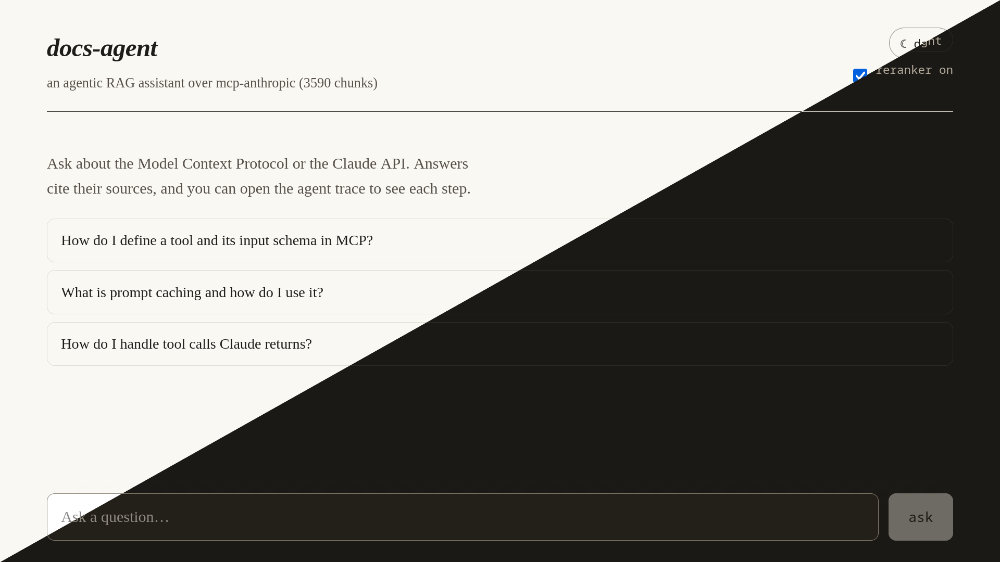

<div align="center">

# docs-agent

**An agentic RAG assistant for developer docs.**

You ask a question, it plans a search, retrieves, reranks the candidates with a
cross-encoder, and answers with citations. Every answer carries a trace of what
the agent did at each step.


[**Live demo**](https://docs-agent-wine.vercel.app)



</div>

> **First load:** the API runs on Render's free tier and sleeps when idle, so the first question can take 30 to 60 seconds to wake the server. Subsequent answers return in normal time.

---

## What it does

- **Plans, not one-shot.** A small agent loop rewrites the question into a search
  query, retrieves, and decides whether to search again or answer.
- **Reranks for a reason.** A cross-encoder reorders the candidates, and that
  choice is backed by an eval instead of a hunch (numbers below).
- **Cites and shows its work.** Answers carry `[n]` citations, and every request
  returns its steps: the rewritten query, which chunks came back, the rerank
  scores, and which sources the answer used.
- **Provider-agnostic.** The chat model, embedder, reranker, and vector store
  each sit behind a small interface. Local dev runs ONNX models (fastembed, no
  torch) and an in-process store, so there is nothing to spin up. Deploy points
  the same code at a hosted embed/rerank API and pgvector on Supabase.
- **Swappable corpus.** Edit `backend/corpus.yaml`, re-run the ingest, and the
  assistant answers over whatever you point it at. The default is the Model
  Context Protocol docs plus a focused slice of the Claude developer docs
  (3,590 chunks).

## How it works

```
question
   │
   ▼
rewrite the query ─▶ retrieve top-k (bi-encoder) ─▶ rerank (cross-encoder) ─▶ answer with [n] citations
   ▲                                                                              │
   └──────────────────────── search again if the results are thin ◀──────────────┘
```

The loop talks to the model through a small JSON action protocol rather than
native function calling, so it runs the same on any chat model, including the
free ones on OpenRouter. Each step is recorded, which is what the trace panel
in the UI shows.

## Retrieval, measured

The reranker is on by default, but only because the eval harness says it should
be. Over a 25-question labeled set, with the cross-encoder off vs on:

| metric  | vector only | + reranker | delta  |
| ------- | :---------: | :--------: | :----: |
| hit@1   |    0.76     |    0.56    | -0.20  |
| hit@3   |    0.88     |    0.92    | +0.04  |
| hit@5   |    0.88     |    0.96    | +0.08  |
| MRR     |    0.82     |    0.72    | -0.10  |

hit@5 is the number that matters here, because the agent answers from the top 5
chunks. The reranker takes it from 0.88 to 0.96. It costs some top-1 precision
(hit@1 and MRR drop), which would matter more for a "single best link" feature
than for feeding context to an LLM. So reranking stays on, and the harness is
what made that call.

Answers are also graded end to end by an LLM judge (`--judge`). On the sample it
scored well, but the judge shares a model family with the answerer, so I read it
as a sanity check, not proof.

## Quick start

**Backend**

```bash
cd backend
python -m venv .venv && source .venv/bin/activate
pip install -r requirements-local.txt
cp .env.example .env          # add your OpenRouter key
python -m app.rag.ingest      # build the index (downloads the corpus once)
uvicorn app.main:app --reload
```

**Frontend**

```bash
cd frontend
npm install
cp .env.example .env          # VITE_API_BASE defaults to localhost:8000
npm run dev                   # http://localhost:5173
```

The chat model runs on free OpenRouter models by default
(`openai/gpt-oss-120b:free`). They are rate-limited per model, so if one is busy,
swap in another `:free` id in `backend/.env`.

## Eval

```bash
cd backend
python -m app.eval.run         # retrieval metrics, reranker off vs on
python -m app.eval.run --judge # also grade end-to-end answers (needs an LLM key)
```

The test set lives in `backend/app/eval/testset.yaml`: questions paired with the
doc page that answers them. Retrieval metrics need no API key. The judge runs the
agent on each question and grades the answer against the docs it retrieved.

## Deploy

- **Database.** A Supabase Postgres with the `vector` extension. Put the
  connection string in `DATABASE_URL`.
- **Ingest into it once.** Run the ingest locally with `VECTOR_STORE=pgvector`,
  `EMBEDDING_PROVIDER=jina`, `EMBEDDING_DIM=1024`, and the database and Jina keys
  set, so the stored embeddings match what the deployed API will query with.
- **Backend.** Render free web service. `render.yaml` has the blueprint. Set the
  secrets (`OPENROUTER_API_KEY`, `JINA_API_KEY`, `DATABASE_URL`) and
  `CORS_ORIGINS` in the dashboard.
- **Frontend.** Vercel. Root directory `frontend`, build `npm run build`, output
  `dist`, and set `VITE_API_BASE` to the Render URL.

## Project layout

```
backend/
  app/
    providers/   chat, embeddings, rerank backends + the registry
    rag/         corpus loader, chunker, vector store, retrieval pipeline
    agent/       the loop, prompts, and trace types
    eval/        test set, metrics, judge, runner
  corpus.yaml    which docs to ingest
frontend/        React + Vite chat UI with the trace panel
```
